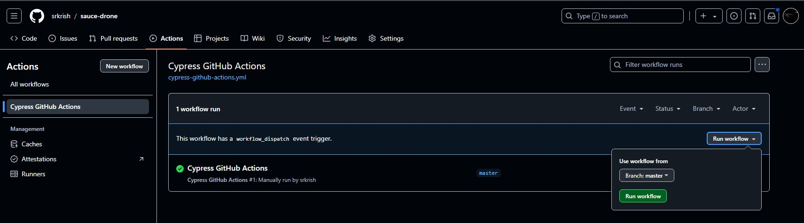

# Cypress e2e (saucedemo)

This project contains end-to-end tests for (https://www.saucedemo.com/v1) using Cypress. The tests cover various functionalities such as login and product list validation.

## Project Structure

```
.github/
	workflows/
		cypress-github-actions.yml
.gitignore
.prettierrc
cypress/
	e2e/
		login/
			page/
				login.page.ts
			tests/
				login.cy.ts
		ProductList/
			page/
				productList.page.ts
			tests/
				productList.cy.ts
	fixtures/
		inventory.json
	screenshots/
	support/
		commands.ts
		e2e.ts
cypress.config.ts
cypress.env.json
package.json
tsconfig.json
```

## Setup

1. **Clone the repository**:
    ```sh
    git clone <repository-url>
    cd <repository-directory>
    ```

2. **Install dependencies**:
    ```sh
    npm install
    ```

3. **Set up environment variables**:
    - Create a cypress.env.json file in the root directory with the following structure:
    ```json
    {
        "users": {
            "standard": {
                "username": "standard_user",
                "password": "secret_sauce"
            },
            "lockedOut": {
                "username": "locked_out_user",
                "password": "secret_sauce"
            }
        }
    }
    ```

## Running Tests

### Locally(headless)
```sh
npx cypress run
```

### Locally(Cypress app)
```sh
npx cypress open
```

This will open the Cypress Test Runner, where you can select and run individual test files.

### CI/CD with GitHub Actions

The project is set up to run Cypress tests using GitHub Actions. The workflow configuration can be found in the following file

```.github/workflows/cypress-github-actions.yml```

At present, the workflow is triggered manually via the "workflow_dispatch" event.



